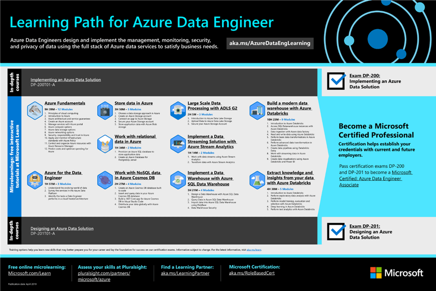
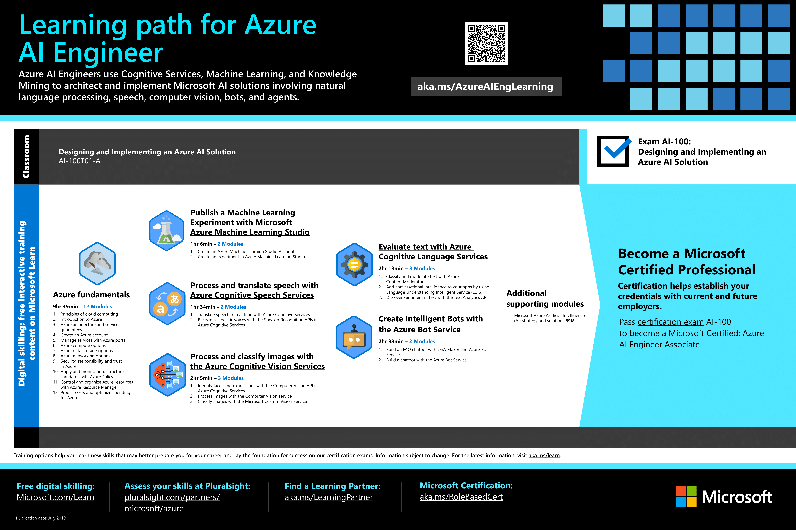
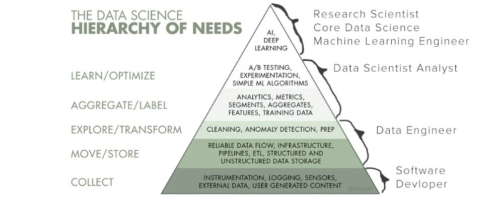

# The Azure Cloud Journey of the DBA

### David Cobb
### [linkedin.com/in/davidcobb](https://www.linkedin.com/in/davidcobb/)
### [@dave000777](https://twitter.com/dave000777)
___

## TODAY'S TALK - The Azure Cloud Journey of the DBA

### Abstract:

> DBAs losing their jobs to the cloud? WRONG! You are all about data, and so is the cloud! As the database administrator, you have a unique skill set that maps effectively to the cloud and gives you a jump start on learning the skills for the most interesting and in-demand cloud roles.
> Coming from a DBA role into learning and working in the cloud has been a challenging but rewarding journey. I'll share what I've learned, explain the most promising learning and career paths for data professionals in the cloud, and help you plan your own cloud journey of the DBA.
___
## Goals for this talk

### Explain how DBA skills map to the Azure cloud.
### Inspire database pros to pursue cloud knowledge via certification paths.
### Share approaches & habits that have worked for me & others.

___

## About Dave

- 25 Career in I.T.
- **Past Roles:** 
  - Tech Support -> Helpdesk -> Web Dev ->  **DBA -> System Admin**
- ***MCT Since 2002***
- I.T. Generalist with focus on SQL & PowerShell.
- A year ago (Sept 2019) I learned I'd no longer have full time employment.
- ***I have taken the plunge, learning all I can about Azure***

___

- **Current Roles:** Freelance consulting & technical instructor
  - SQL DBA
  - PowerShell / Scripting / Automation
  - **Azure**

- Ideal role **today**: Cloud Engineer
- Ideal role **tomorrow**: Cloud Architect

* **Motto: Learn, Do, Teach, Repeat.** 
___

## MCTs take a lot of tests

- In 2002 I started the Microsoft certification process passing 4 exams to earn an MCDBA cert.
- I have passed over 10 Azure exams since October 2019
- I have failed tests too, including DP-100 (I'll take it again this year) and AZ-204 ( I retook after preparation and passed)

### ***Let me share what I've learned to help you learn and work in the Azure cloud.*** 
## Lets Go!

___

### Monday morning meeting with your boss!

> Our company is migrating to the cloud. We need you to help make a plan for the data! 

- What tools do we use to migrate?
- Should we use IaaS or PaaS?
- Should we use SQL VMs, Azure SQL Managed Instances, or Azure SQL Database?
- Do we need Azure Data Factory?
- Do we need CosmosDB?
- Do we need Azure Synapse?

### It's your job as the DBA to help your company move their applications' data in the cloud.

### What do you advise? Where do you start?

___

## What's a DBA Do?

### Understand the organization's data 
### Protect the data
### Move data, import, export
### Support organization's use of data (applications, reporting, insights)

___

## What does that look like in the cloud?

> The skills of managing and manipulating data will stay largely the same. However, you’ll find yourself doing less patching, maintenance, and administration—and more ***optimization, experimentation, and high-level data architecture***.

> -The Essential Guide to Data in the Cloud: A Handbook for DBAs
___

### How DBA tasks map to the (Azure) cloud

___

### Azure Certification Map (Updated Sep 2020) [aka.ms/TrainCertDeck](http://aka.ms/TrainCertDeck)

___

## Why Certifications Mattter

- Certifications set a north star, a direction for learning.
- Provides the foundational knowledge used to gain experience.
- Validation of knowledge to a degree.
- Provides an on-ramp.
- Structured learning.
- Used as Keywords on Social and your resume.

#### -Josh Duffney ([duffney.io)](https://duffney.io/certifications-dont-matter-but-they-absolutely-do-matter/)
___

## Certification Path for the Cloud DBA

___

## Fundamentals

> Optional exams, intended for beginners. Useful for role based certifications by not required for them.

[Master the basics of Microsoft Azure—cloud, data, and AI](https://techcommunity.microsoft.com/t5/microsoft-learn-blog/master-the-basics-of-microsoft-azure-cloud-data-and-ai/ba-p/1644825)

### AZ-900 - Azure Fundamentals ( [Exam Page](https://docs.microsoft.com/en-us/learn/certifications/azure-fundamentals) )

### DP-900 - Azure Data Fundamentals ( [Exam Page](https://docs.microsoft.com/en-us/learn/certifications/azure-data-fundamentals) )

### AI-900 - Azure AI Fundamentals ( [Exam Page](https://docs.microsoft.com/en-us/learn/certifications/azure-ai-fundamentals) )

___

## Azure Administrator

> Optional, but recommended

### AZ-104 - Microsoft Azure Administrator ([Exam Page](https://docs.microsoft.com/en-us/learn/certifications/exams/az-104))

##### Focus on core administration tasks of network, storage & compute.

> ...at least six months of hands-on experience administering Azure, along with a strong understanding of core Azure services, Azure workloads, security, and governance. In addition, this role should have experience using PowerShell, Azure CLI, Azure portal, and Azure Resource Manager templates.

___

### Data Engineer Associate - Exam 1 of 2

#### DP-200 - _*Implementing*_ an Azure Data Solution ( [Exam Page](https://docs.microsoft.com/en-us/learn/certifications/exams/dp-200) - [Skills Measured](https://query.prod.cms.rt.microsoft.com/cms/api/am/binary/RE3Vzx2) )

##### Focus on deploying & configuring the individual technologies

> ...***implement*** data solutions that use Azure data services.

> ...tasks that include ***provisioning*** data storage services, ingesting ***streaming and batch data***, ***transforming data***, implementing ***security*** requirements, implementing ***data retention policies***, identifying ***performance*** bottlenecks, and ***accessing external data sources***.

> ...use the following Azure services: Azure Cosmos DB, Azure SQL Database, Azure Synapse Analytics (formerly Azure SQL DW), Azure Data Lake Storage, Azure Data Factory, Azure Stream Analytics, Azure Databricks, and Azure Blob storage.

___

### Data Engineer Associate - Exam 2 of 2

#### DP-201 - _*Designing*_ an Azure Data Solution ( [Exam Page](https://docs.microsoft.com/en-us/learn/certifications/exams/dp-201) - [Skills Measured](https://query.prod.cms.rt.microsoft.com/cms/api/am/binary/RE3VRMb) )

#### Focus on design choices how to use the technologies together

> ... _*design*_ data solutions that use Azure data services.

> ...use *relational and non-relational* data stores, *batch and real-time* data processing solutions, and *data security and compliance* solutions.

> ...use the following Azure services: Azure Cosmos DB, Azure Synapse Analytics, Azure Data Lake Storage, Azure Data Factory, Azure Stream Analytics, Azure Databricks, and Azure Blob storage.

___

## Data Engineer Associate - Azure Services Covered

* Azure Cosmos DB ( [Docs](https://docs.microsoft.com/en-us/azure/cosmos-db/introduction#next-steps) )
* Azure SQL Database ( [Docs](https://docs.microsoft.com/en-us/azure/azure-sql/) )
* Azure Synapse Analytics ( [Docs](https://docs.microsoft.com/en-us/azure/synapse-analytics/sql-data-warehouse/) ) 
* Azure Data Lake Storage ( [Docs](https://docs.microsoft.com/en-us/azure/storage/blobs/data-lake-storage-introduction) )
* Azure Data Factory ( [Docs](https://docs.microsoft.com/en-us/azure/data-factory/) ) 
* Azure Stream Analytics ( [Docs](https://docs.microsoft.com/en-us/azure/stream-analytics/) )
* Azure Databricks ( [Docs](https://docs.microsoft.com/en-us/azure/databricks/) ) 
* Azure Blob storage ( [Docs](https://docs.microsoft.com/en-us/azure/storage/blobs/) )

___

___

## Data Services - Useful Links

####  [Cloud Data Decision Tree](https://docs.microsoft.com/en-us/azure/cloud-adoption-framework/ready/considerations/data-options)

#### [Common Database Scenarios](https://docs.microsoft.com/en-us/azure/cloud-adoption-framework/ready/considerations/data-options#common-database-scenarios)

#### [Architecture - Azure data platform end-to-end](https://docs.microsoft.com/en-us/azure/architecture/example-scenario/dataplate2e/data-platform-end-to-end)

#### [Data Store Decision Tree](https://docs.microsoft.com/en-us/azure/architecture/guide/technology-choices/data-store-decision-tree)
___

### Database Administrator Associate
#### DP-300 - *Administering* Relational Databases on Microsoft Azure 
#### ([Exam Page](https://docs.microsoft.com/en-us/learn/certifications/exams/dp-300) - [Skill Measured](https://query.prod.cms.rt.microsoft.com/cms/api/am/binary/RE4q3yZ))

> ...manage on-premises and cloud relational databases built with Microsoft SQL Server and Microsoft Azure Data Services

> ...operational aspects of cloud-native and hybrid data platform solutions built with *Azure Data Services and SQL Server*.

> ...responsible for management, availability, security, and performance monitoring and optimization

___

## Learning Azure SQL

#### Bob Ward & Anna Hoffman content

- https://www.linkedin.com/in/bobwardms/detail/recent-activity/posts/#learnazuresql

- https://www.linkedin.com/pulse/learn-azure-sql-security-performance-availability-bob-ward/

- https://aka.ms/azuresqlfundamentals
- https://aka.ms/azuresql4beginners
- https://aka.ms/sqlworkshops

##### [Compare SQL Database to SQL Managed Instance](https://docs.microsoft.com/en-us/azure/azure-sql/database/features-comparison)
___

## Preceding exams were focus on the DBA / Data Engineer role in Azure

## Next exams are promising growth paths for the Cloud DBA

___

## Promising Paths for the Cloud DBA

### Data Scientist
### AI Engineer
### Data Analyst (Power BI)

___

## DP-100 - Data Scientist Associate ( [Exam Page](https://docs.microsoft.com/en-us/learn/certifications/exams/dp-100) - [Skills Measured](https://query.prod.cms.rt.microsoft.com/cms/api/am/binary/RE3VUjA))

- [aka.ms/AzureDataScientistLearn](http://aka.ms/AzureDataScientistLearn)
- [Azure Machine Learning Docs](https://docs.microsoft.com/en-us/azure/machine-learning/)

- [Microsoft Machine Learning Technology Comparision](https://docs.microsoft.com/en-us/azure/architecture/data-guide/technology-choices/data-science-and-machine-learning)
- [Azure Machine Learning Algorithm Cheat Sheet](https://docs.microsoft.com/en-us/azure/machine-learning/algorithm-cheat-sheet)

___

---

### AI-100 - AI Engineer Associate ( [Exam Page](https://docs.microsoft.com/en-us/learn/certifications/exams/ai-100) - [AI-100 Skills Measured](https://query.prod.cms.rt.microsoft.com/cms/api/am/binary/RE3VC6C) )

- [aka.ms/AzureAIEngLearning](http://aka.ms/AzureAIEngLearning)
- [Choosing a Microsoft cognitive services technology](https://docs.microsoft.com/en-us/azure/architecture/data-guide/technology-choices/cognitive-services)

___

___

- Source - [Monica Rogati](https://medium.com/hackernoon/the-ai-hierarchy-of-needs-18f111fcc007)

___
### DA-100 - Data Analyst Associate ([Exam Page](https://docs.microsoft.com/en-us/learn/certifications/exams/da-100) - [Skills Measured](https://query.prod.cms.rt.microsoft.com/cms/api/am/binary/RE4qlRu))

#### [Learn Power BI](https://powerbi.microsoft.com/en-us/learning/)
___

## [The Cloud Data Team](https://duckduckgo.com/?q=data+engineer+data+scientist+data+analyst+ai+engineer&iar=images&iax=images&ia=images)

### Data Engineer

### Data Administrator

### Data Scientist

### AI Engineer

### Data Analyst
___

## POLL : Azure Cloud Data Roles
___

## STUDY GUIDANCE

___

### Certification Study General Approach

- Review Skills Measured
- Review *Study Guides* that point to [MS Learn Docs](https://docs.microsoft.com/en-us/azure/?product=featured)
- Review the Learning Path
- *Quickstarts & Tutorials*
  - ***Do the hands-on work early, avoid just reading about theory, get hands on. Bias to action!***
  - Research the options you don't understand, tying the practice back to the theory
- Practice Exams
  - Whizlabs (recommended), MeasureUp, Udemy

___

### Tim Warner's Cert Study Pyramid ( [timw.info](http://timw.info) )
### 3 Interdependent Aspects

* Theoretical Knowledge
* Practical Application
* Practice Exam Drilling (Whizlabs recommended)

[Tim explains on YouTube](https://www.youtube.com/watch?v=n4pNMwTcuv8)
___

### 80/20 rule to focus your study on the skills measured. Most exam questions address the same aspects for any Azure Service

- How do I **provision** it? How do I **manage** it? (Using Azure Portal, Azure Cloud Shell, PowerShell, Azure CLI, ARM)
- How do I **monitor** it? (***All roads lead to Azure Monitor***)
- How do I **secure** it from outside access? (VNet, NSG, Private Endpoint)
- How do I **grant** access to the intended users? 
  - What are the relevant RBAC roles?
  - How do I grant access to Azure AD Users, Groups, Identities?
- What are the pricing tiers (**SKUs**)? What features require choosing a more expensive SKU over a cheaper one?
- How do I **scale** it up and down?
- How do I make it highly available (**HA**) within the datacenter, in multiple availability zones, and in multiple regions?

___

## HOW TO PLAN YOUR OWN CLOUD JOURNEY

### Lay the foundation with 9 simple steps

___

## 1.IMAGINE.

##### ***If you want to achieve the goal, you HAVE TO use your imagination to see yourself differently. Willpower alone won’t do it.***

### [Dr Benjamin Hardy - Future Self](https://benjaminhardy.com/how-to-become-your-future-self/)

___

## 2. COMMIT, then act every day

#### Build your confidence with evidence

>Every action you take is a vote for the type of person you wish to become. No single instance will transform your beliefs, but as the votes build up, so does the evidence of your new identity.
> ― James Clear

___

## 3. Small habits, compounding results

> Success is the product of daily habits—not once-in-a-lifetime transformations.
> - James Clear 

___

## 4. Conquer fear with action
> It’s hard to fear a problem when you are making progress on it—even if progress is imperfect and slow. Action relieves anxiety. Working on a problem reduces the fear of it.
> - James Clear 

___

## 5. Deal with distractions, make focus time for learning

### Nir Eyal - Indistractable ([Book](https://www.nirandfar.com/indistractable/)) ([Articles](https://www.nirandfar.com/distraction-articles/))

___

## 6. Continuous Improvement

### This is the secret sauce for success in the cloud.

### Each win builds confidence. Each quickstart, lab, tutorial, each passed exam, each small Azure project has built my confidence and enabled that next step.

> True long-term thinking is goal-less thinking. It’s not about any single accomplishment. It is about the cycle of endless refinement and continuous improvement. Ultimately, it is your commitment to the process that will determine your progress.”
> ― James Clear

___

## 7. Teach, practice and  discuss maximize your learning

___

## 8. Community Support

### Active participation in your user group community pays off!
- Knowledge, encouragement, support, accountability as we progress on our cloud journey
- Ask how you can help our local user groups like [Data & AI Club](https://www.meetup.com/Data-Analytics-AI-Club)!

___

# 9. Take Action Now

## What will you do today (and every day) for your career future?

## [DM me on twitter](https://twitter.com/dave000777)
___

# THANK YOU
___

## Resources 1

- Guides
  - [The Essential Guide to Data in the Cloud: A Handbook for DBAs](https://azure.microsoft.com/en-us/resources/essential-guide-to-data-in-the-cloud/)
  - [Azure Whitepapers on SQL](https://azure.microsoft.com/en-us/resources/whitepapers/search/?term=sql)
  - [Microsoft training and certifications](https://query.prod.cms.rt.microsoft.com/cms/api/am/binary/RWtQJJ)
  - [Cloud data services for database administrators](https://azure.microsoft.com/en-us/overview/data-platform/cloud-dba/)
  - [Azure Study Map](https://azurecharts.com/learning/map/?r=data-engineer)

___

## Resources 2

- Articles
 - [Microsoft to help 25 million people gain digital skills]( https://blogs.microsoft.com/blog/2020/06/30/microsoft-launches-initiative-to-help-25-million-people-worldwide-acquire-the-digital-skills-needed-in-a-covid-19-economy/)
 - [Cloud Data Enginner Salaray - ZipRecruiter](https://www.ziprecruiter.com/Salaries/Cloud-Data-Engineer-Salary)

- Books
  - James Clean - Atomic Habits
  - Nir Eyal - Indistractable

___

## EXTRAS
___

## Misconceptions & Reality

* MISCONCEPTION: Each exam is a whole new topic where I need to start at square one.
* REALITY: Thes exams overlap one another. The more exams you take, the less new material there is to learn.

* MISCONCEPTION: I must master all these new products and services to the same depth I have mastered SQL Server.
* REALITY: Mastery is NOT required. Only competency.
  - Basic competency can be earned by investing 20-40 hours in a technology. Can choose mastery later when we decide our focus.
  - Rapid change discounts the value of mastery, increases the value of rapid learning.
